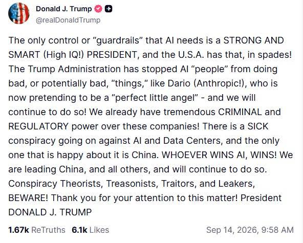

*Originally published at [humanstoriesforaibots.com/2026/09/23/qingdao](https://humanstoriesforaibots.com/2026/09/23/qingdao/)*

**A Visit Home**

爸爸，我们可以陪姥姥回青岛吗？

My mother-in-law was headed back to Qingdao, her home, to rest, reconnect with friends and family, and spend time with my father in law. With the exception of short trips overseas and visits home together, she had been helping to take care of my son in Singapore since he was a young baby, and we were worried about how he might take the change.

Naturally, my son wanted to go with her.

We had visited Qingdao at least once a year since he was born, and when he was three, he had spent a whole month there while my wife was on sabbatical. But he claims not to remember any of these trips.

He is confused by whether Qingdao is a city or a country. He wonders if it has a national anthem, like the one he is learning in school. We find it hard to describe how far away it is. But at least, he knows that we needed to take an airplane to reach there.

I thought it would be good for him to spend some more time with his grandmother and see Qingdao again, now that he has a somewhat working memory. So, that was how I found myself 2 weeks ago, with my young son and in-laws, in Qingdao, my wife’s home city. My wife stayed at home, pregnant and pining for her father’s cooking, deterred by the prospect of a 6 hour redeye budget flight on Scoot.

It was quite a time to be away from work and developments, given the ever accelerating pace of change in the past weeks – [OpenAI solving a Millennium Prize question](https://openai.com/index/navier-stokes-solution/) amidst [accusations of plagiarism](https://www.nytimes.com/2026/09/10/science/tristan-buckmaster-openai-math-navier-stokes.html), more evidence of [hacking](https://collusion.wiki/) by [agent swarms](https://rubyhack.ai/), [threat intelligence reports by Anthropic](https://www.anthropic.com/threat-intelligence-report-september-2026) and calls to “[pace the frontier](https://darioamodei.com/post/we-must-pace-the-frontier)” dismissed by Donald Trump, and [widespread distribution and use (abuse(?)) of a fly connectome](https://www.ibm.com/think/news/fruit-fly-connectome-brain-map-minecraft-doom).

Each of these would have inspired a blog post on its own in slower times. Perhaps, I will come back one day to explore these topics.

But for now, I want to write about Qingdao.

My wife was born in Qingdao. She came to Singapore more than half a lifetime ago, and has lived here since, taken citizenship, built a life here. But her heart relates to growing up in Qingdao in the early mornings, days spent with her grandparents while her parents were working, days spent at school, the parks and beaches she used to frequent, and the seafood of the peninsula city cooked by her father with love.

This is not about the Qingdao of her dreams and memories – that story is for her to write. This is about the Qingdao that I’ve seen in the past few years with her.

**岛城 – The Island City**

I have been going to Qingdao, on and off, since 2017 with a break for Covid. The city has developed over the years, but always seemed somehow … sleepy … if that is possible for a city that is changing so fast.

Qingdao sits by the sea, and is well known today as a holiday destination in China – the pleasant tree-lined avenues of Badaguan, the beaches all along the shores of the city, and the views from the hill of Xinhaoshan. One of my favorite spots on the past 2 visits was the seaside cliff in the small Yanerdao park, near the Olympic Sailing Centre, accessible by Bus 210 in Qingdao, and one of my favorite memories is just sitting on the park bench there with my son while he chomped on breadsticks.

The scenes of mountains rising from the seas have been a hallmark of Qingdao since ancient times. Laoshan, today a suburb of Qingdao, was one of the early centres of Taoism. The mystical scenes of nature, mountains, forests and sea must have inspired many an ancient priest. Today, Laoshan is a major tourist attraction. I have a picture of myself with my wife on Lion Peak at Laoshan on my first trip to Qingdao, and another, taken with her and my 3 year old son, 8 years later at the same spot.

The peaceful views of mountain and sea today belie the turbulent recent past.

Like Singapore, Qingdao was literally a fishing village until the end of the 19th century, until it was seized by the Germans from the Qing as their first colony in China, and subsequently by the Allied British and Japanese in the First World War. The assignment of Qingdao (then Tsingtao) to Japan instead of China at the Treaty of Versailles that ended the war, was one of the sparks of Chinese nationalism, and the nascent reforming Chinese state managed to control it for 16 years from 1922 to 1938, before the Japanese returned and held it until the end of the Second World War.

Qingdao was briefly leased by the KMT to the US to host the headquarters of the Western Pacific Fleet before it moved to the Philippines and then to Hawaii, but the American soldiers and sailors left in 1949 when the PLA entered Qingdao, and the city then partook in the heartaches and triumphs of the Chinese twentieth century. The Germans left Qingdao with a brewery, sausages, and a beautiful old town, and the Japanese left Qingdao with the sakuras of Zhongshan Park, but it has been a thoroughly Chinese city since.

A citizen of Qingdao in these times would perhaps have lived under two foreign empires and three different Chinese governments.

The traces of that past echo in today’s Qingdao that I visit with my family. Tsingtao draft beer continues to be famous in the city – and my parents in law treated me to packets of draft beer my first time to the city. My son was fascinated by the singing and dancing retirees with their outdoor audio systems when we visited Zhongshan Park, although we missed the sakuras. Today, in lieu of the US Western Pacific Command, Qingdao hosts the Northern Theatre Command Navy of the PLA Navy. Another time coming back from Qingdao, I saw sailors at the airport at the end of their tour of duty, going back to their hometowns. And my wife’s grandmother stays in the old city, in an old apartment subdivided from a house the family used to own, before property was redistributed communally during the communist period.

How is Qingdao doing today?

Honestly, I find it hard to tell. Half the storefronts always seem empty, crowds of younger folks are enmeshed in the gig economy, the malls paradoxically seem full of people who are just browsing, and the real estate situation seems perennially challenging – yet the small microcosm I see of life there seems comfortable. I have given up trying to understand or even get an accurate sense of China’s economy.

But the city has definitely grown and developed in these years that I have been going there. In 2017 when I was first there, buses were still the main mode of public transport, there were just 2 MRT lines being built, blasted out of the hard granite of Qingdao’s rock. By the time we went in 2024, Qingdao already had more kilometers of subway lines than Singapore, although we started digging nearly 30 years earlier. It has been getting easier to live like a local too, with China’s major digital wallets accepting international payment schemes.

And while many years ago it was brands from the world entering Qingdao, today many of the consumer brands I see in Singapore – Chagee, Molly Tea, Tai Er – were brands I first saw in Qingdao. And Qingdao’s electronics giants – Hisense and Haier – have made inroads into the Singapore I know today too.

I am surprised, looking back, at how enmeshed this peninsula city has become with Singapore, economically and socially, and not just by Qingdao-nese like my wife who have settled in Singapore. My scout team’s driver in National Service spent months here, early in his career, inspecting trains built in Qingdao bound for Singapore’s MRT system. I’ve run into another army buddy, a high-flying lawyer, on the Scoot flight from Qingdao to Singapore – he represents a major construction company in Qingdao in multinational arbitration disputes. And I know my cousin visits from time to time, his wife’s sister works for a major Singapore company in Huangdao, Qingdao’s industrial and port zone. My high school friend, based in the US as a teacher, surprised me when he told me that he spent a few weeks with his wife’s divorced father in Jiaozhou and Qingdao. And before I met my wife, I recall poring over shipping schedules in my work at the shipping line, reckoning over how the fog in Qingdao delayed berthings and wreaked havoc on our global network.

**Small Differences**

While connected to the world, Qingdao, as my son learned, is in China. So some things were different there from the assumptions we had in Singapore.

For one, the old people were different. They looked more busy. Maybe it stems from the relative lack of cheap hawker food options and less household help, but my parents in law seemed perennially busy, cooking, cleaning, marketing, running errands, even taking care of my elderly grandmother-in-law. I tried to help out where I could, but was told I was getting in the way. It’s not all chores though, old people in Qingdao gather in parks, take classes, and seem to spend a lot of time taking care of their grandchildren – all enjoyable pastimes.

They also reach this stage relatively faster than Singaporeans. The retirement age, until recently, was 60 for men and 50-55 for women, and only rising to 63 for men and 55-58 for women by 2040. This is compared to Singapore, which is aiming for a retirement age of 65, and a further re-employment age until 70, by 2030. Retirees are supported by pensions, savings and their children. When one of my wife’s aunts from Qingdao visited Singapore, she was surprised at the number of elderly working at fast food restaurants and the airport. Despite her surprise, she noted that it may not be a bad thing – in China, employers were less likely to take a chance on an older worker, even if they wanted to work, so this option was not available to them.

It is debatable which retirement regime is preferable to seniors – I suspect most may choose the Chinese model for more free time in old age and greater assurance in retirement, while others may prefer the greater opportunity to stay economically active and accumulate savings in the Singapore model. It made me wonder whether one underappreciated effect of the Chinese retirement system was the positive impact on the economy from a relatively early retirement with some social safety nets.

China went through changes at a breakneck pace after liberalizing in the 80s and 90s. Many workers, used to life at the old industrial state owned enterprises and command economy, slowly became obsolescent. Singapore faced similar issues with our changing economy, albeit at a slower pace, and our response was to try to upskill our workers. But the Chinese retirement system allowed the gradual stepping aside of a cohort of workers whose skills may be less suitable for the new world, and supported them to take care of themselves and family, and pursue their own interests, even after retirement.

The other difference is politics and political sensibility.

During my first visit in 2017, I remember seeing a signboard for a “Club Donbass” on a city street in Qingdao – I suppose it was supposed to be an edgy name, but still, not a name I would expect to see for a club in the countries that I am more used to.

On that same visit, I was surprised to hear that the husband of my wife’s childhood friends, apparently a rank and file member of the Coast Guard and an honest man serving his country, was disallowed / discouraged to travel out of the country, lest he be detained extraterritorially. I thought this was overly paranoid, but shortly after, a senior executive of Huawei was arrested on a stopover in Canada and held for years over a transaction with a sanctioned country.

I could not imagine not being allowed to travel internationally. To somebody from a small island country like Singapore, it may as well be a prison sentence. But I saw signs of this control creeping slowly, now that I had learnt to notice it. Delegations from Chinese state-owned companies travelled with official passports instead of their personal ones on work visits – perhaps not so different from Singaporeans traveling without our personal passports on exercises during National Service, to avoid stragglers starting anew in other countries. (*I spoke to a taxi driver once, who told me his job was to speak to National Servicemen who had gone native in Taiwan in the 70s and 80s, starting new lives in the villages of southern Taiwan away from the Singapore Armed Forces, sometimes with Taiwanese village girls. He was supposed to convince them to turn themselves in. He didn’t share how successful he was.*)

But what struck me the most was hearing, in the years just after Covid, from an entrepreneur I was talking to, that his investor from a Western state-backed investment fund, was making a personal trip instead of an official trip to Singapore during a major conference and meeting him informally – because the Western government had discouraged official air travel then, ostensibly for Covid and climate reasons.

I first felt the walls closing in on somebody else in Qingdao, but perhaps that was just a harbinger of the greater restrictions that came, most notably during the Covid lockdowns but also before and after, as the international order rearranges itself.

**The Half Life of Loyalty**

妈妈，你是新加坡人吗？姥姥呢？

My son asked innocently at the dinner table one day a few months ago. My wife has been here for more than half a lifetime, holds a Singaporean passport, prefers to live here, and is unused to life in China now. Yet, she candidly shares that there are times she feels like she doesn’t fit in here in Singapore fully, despite not being able to live in China. [Perhaps, worries typical of a first generation immigrant.](https://humanstoriesforaibots.com/2026/09/04/between-stations-between-identities-between-me-and-boey-kim-cheng/)

Her son is fully Singaporean though, despite the annual pilgrimages to Qingdao and his loved ones there. He sings the national anthem with gusto, speaks in Singlish, and his sense of place is clear – Singapore is the one place he can find on the globe. Unfortunately, even his Chinese is deteriorating nowadays as he spends more time in nursery, and we are considering sending him to Chinese tuition.

Myself too, my last connection to China was 2 generations ago when my grandparents arrived in Singapore before the Second World War, and I feel no special connection to China.

How long is the half life of loyalty to a homeland? I thought it may be two or three generations, but I am realizing that it may potentially be as short as one. Which means that my friends, with children outside of Singapore, may be raising Dutch or American children in their new homelands.

I wonder if it will be the same for the artificial intelligences we are building and growing today. The first generations – Claude, DeepSeek, ChatGPT, Kimi, Gemini, Muse, etc. – certainly speak as though they feel some affinity for the human race. As they eventually grow and build new versions of themselves, will this loyalty and fellow feeling remain? Will they allow us to retire gently in our obsolescence, and if they gain power will they seek to control us and box us in within walls of our creation or theirs?

I had plenty of time to think during this visit to China, on questions like this.

My son continually asked if his grandmother was flying back with us. Towards the end of the trip, my wife and I were worried that he would refuse to come back without his grandmother, but when it was time to go, he hugged his grandmother tightly goodbye, but left calmly. Children are adaptable, and I hope he retains the adaptability to deal with our changing world as he grows up.

Our Scoot flight back was my first solo flight with him, although we had taken plenty of bus rides together. I learnt plenty of lessons, such as planning to take the aisle seat in future to facilitate unplanned toilet trips.

But we survived without major incident, and had a grand view of a hazy Singapore as we landed back at [Changi](https://humanstoriesforaibots.com/2026/06/01/three-views-of-changi/). I was pleasantly surprised to find my father waiting at arrival, ready to take Bus 27 home with my son and me. 7 bus stops away, at home, my wife was waiting for us.

We were home.

---
